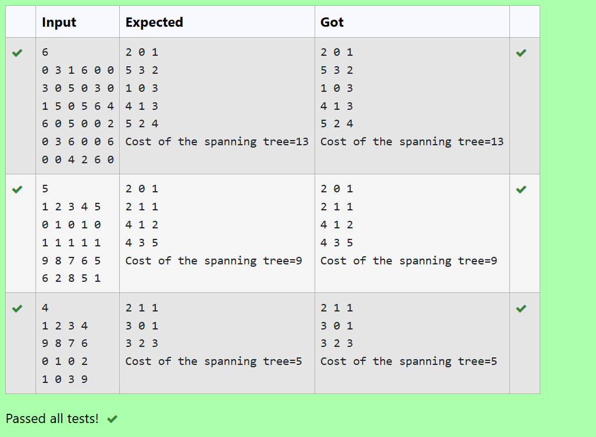

# Ex27 Kruskal’s Algorithm
## DATE: 14/05/25
## AIM:
To write a C program to implement Kruskal's Algorithm for finding minimum cost

## Algorithm
1. Start
2. Read the number of vertices n and the adjacency matrix G.
3. Initialize the edge list elist and extract all edges from the matrix into elist.
4. Sort the edges in increasing order of weight.
5. Initialize a belongs array where each vertex is initially in its own set.
6. Process each edge, checking if the vertices belong to different sets using find. If they do, add 
the edge to the spanlist and unite the sets using union1.
7. Print the edges of the minimum spanning tree along with its total cost.
8. End   

## Program:
```c
/*
Program to implement Kruskal's Algorithm

Developed by: Santhosh T
RegisterNumber: 212223220100
*/
#include<stdio.h>
#defineMAX30
typedefstruct edge
{
    int u,v,w;
} edge;
typedefstruct edgelist
{
    edgedata[MAX];
    int n;
} edgelist;
edgelist elist;
int G[MAX][MAX],n;
edgelist spanlist;
voidkruskal();
int find(int belongs[],int vertexno);
voidunion1(int belongs[],int c1,int c2);
void sort();
voidprint();
int main()
{
    int i,j;
    scanf("%d",&n);
    for(i=0; i<n; i++)
        for(j=0; j<n; j++)
            scanf("%d",&G[i][j]);
    kruskal();
    print();
    return0;
}
voidkruskal()
{
    int belongs[MAX],i,j,cno1,cno2;
    elist.n=0;
    for(i=1; i<n; i++)
        for(j=0; j<i; j++)
            if(G[i][j]!=0)
            {
                elist.data[elist.n].u=i;
                elist.data[elist.n].v=j;
                elist.data[elist.n].w=G[i][j];
                elist.n++;
//---
            }
    sort();
    for(i=0; i<n; i++)
        belongs[i]=i;
    spanlist.n=0;
    for(i=0; i<elist.n; i++)
    {
        cno1=find(belongs,elist.data[i].u);
        cno2=find(belongs,elist.data[i].v);
        if(cno1!=cno2)
        {
            spanlist.data[spanlist.n]=elist.data[i];
            spanlist.n=spanlist.n+1;
            union1(belongs,cno1,cno2);
        }
    }
}
int find(int belongs[],int vertexno)
{
    return(belongs[vertexno]);
}
void union1(int belongs[],int c1,int c2)
{
    int i;
    for(i=0; i<n; i++)
        if(belongs[i]==c2)
            belongs[i]=c1;
}
void sort()
{
    int i,j;
    edgetemp;
    for(i=1; i<elist.n; i++)
        for(j=0; j<elist.n-1; j++)
            if(elist.data[j].w>elist.data[j+1].w)
            {
                temp=elist.data[j];
                elist.data[j]=elist.data[j+1];
                elist.data[j+1]=temp;
            }
}
voidprint()
{
    int i,cost=0;
    for(i=0; i<spanlist.n; i++)
    {
        printf("%d%d%d\n",spanlist.data[i].u,spanlist.data[i].v,spanlist.data[i].w);
        cost=cost+spanlist.data[i].w;
    }
    printf("Cost ofthe spanning tree=%d\n",cost);
}

```

## Output:



## Result:
Thus, the C program to implement Kruskal's Algorithm for finding minimum cost is implemented successfully.
